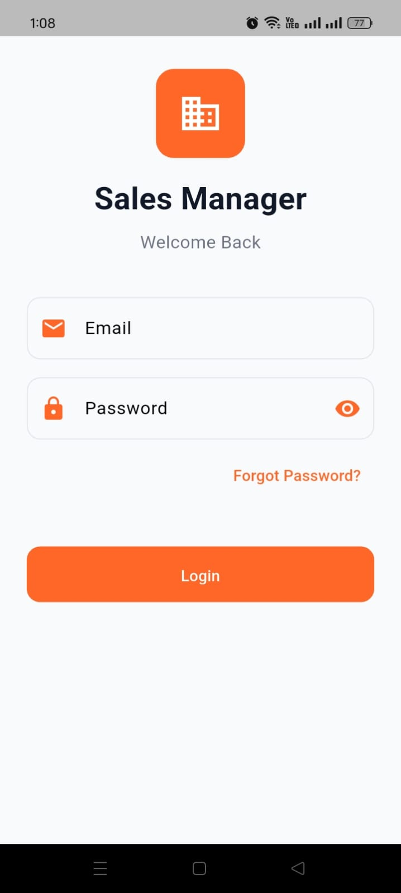
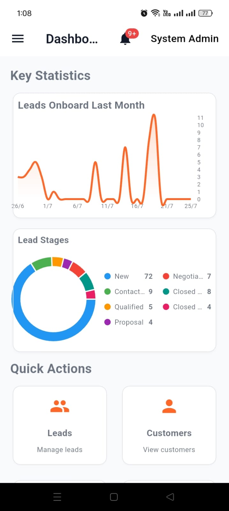
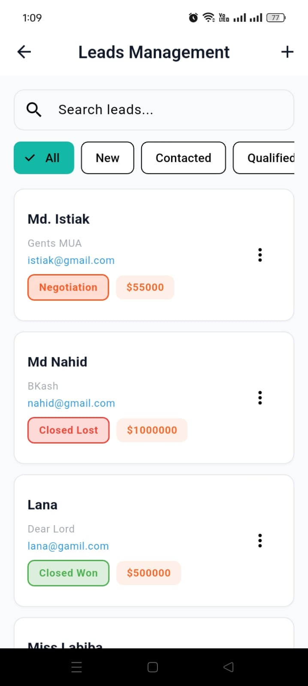
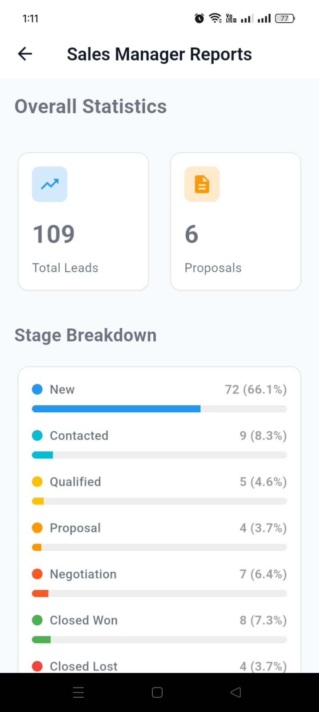
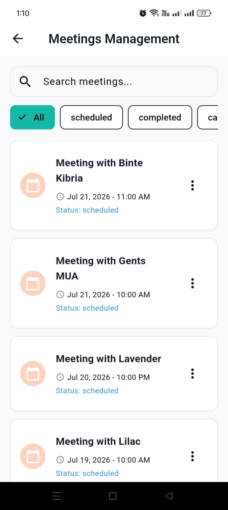
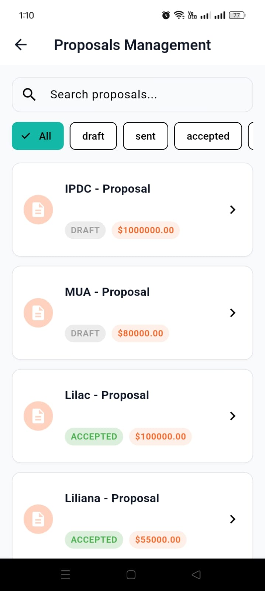
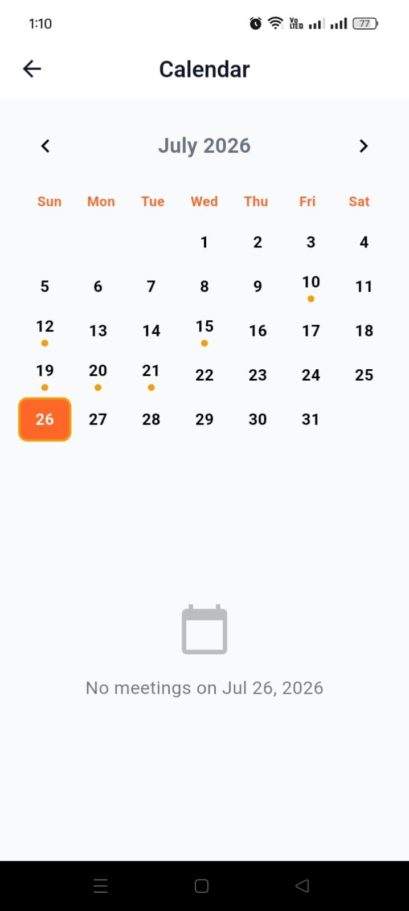
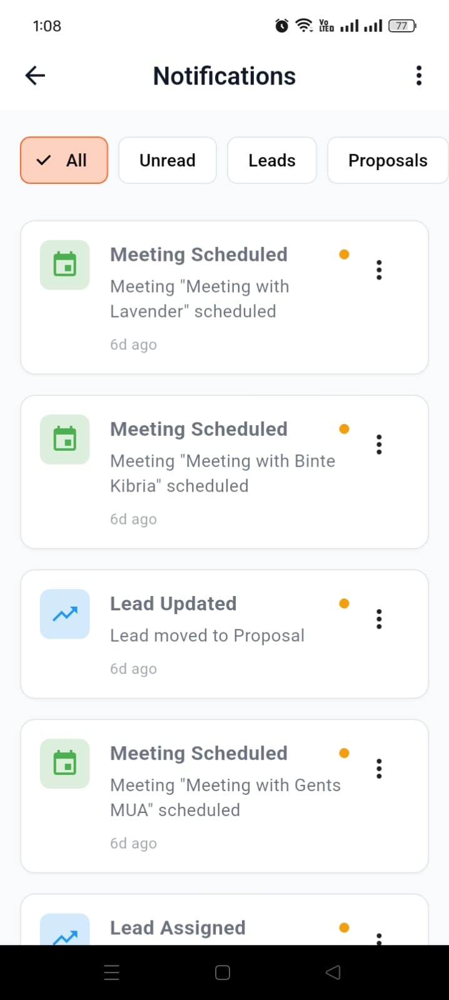

<div align="center">

# Sales Manager

**A web-based customer management and sales automation platform for SMEs.**

Built with Flutter and Supabase to unify leads, customers, proposals, meetings, and team performance in a single, role-aware workspace.

[](https://flutter.dev)
[](https://dart.dev)
[](https://supabase.com)
[](#)
[](#license)

[Features](#features) · [Screenshots](#screenshots) · [Tech Stack](#tech-stack) · [Architecture](#architecture) · [Getting Started](#getting-started) · [Roles & Permissions](#roles--permissions) · [Roadmap](#roadmap)

</div>

---

## Overview

Small and medium businesses often manage customers and sales through a patchwork of spreadsheets, messaging apps, and personal notes. This makes it easy to lose track of leads, miss follow-ups, and lose visibility into what the sales team is actually doing.

**Sales Manager** replaces that patchwork with one centralized platform. It gives sales teams a structured pipeline to move leads from first contact to closed deal, gives managers real-time visibility into team performance, and gives admins full control over users, roles, and data — all backed by Supabase's real-time database and authentication.

## Features

### Authentication & Access
- Secure email/password authentication with a password-recovery flow
- Role-based access control across three roles: **Admin**, **Manager**, **Sales Person**
- Automatic auth gating on all protected routes

### Lead Management
- Create, update, and track leads through every pipeline stage (New → Contacted → Qualified → Proposal → Negotiation → Closed Won/Lost)
- Search and filter leads by stage
- Deal value tracking per lead
- Role-based visibility and lead ownership

### Customer Management
- Centralized customer records tied to lead history
- Role-specific visibility and ownership rules
- Full customer lifecycle support

### Proposal Management
- Create, send, and track proposals (Draft → Sent → Accepted)
- Proposal value tracking per client
- Full historical record of business proposals

### Meeting & Calendar Management
- Schedule and search meetings, linked directly to leads and customers
- Status tracking (scheduled / completed)
- Month-view calendar with per-day agendas

### Dashboard & Reporting
- Real-time KPI overview: lead volume, stage distribution, team activity
- Exportable stage-by-stage conversion reports
- Visual analytics for faster business decisions

### Notifications
- Real-time alerts for lead updates, meetings, and proposals
- Filterable by type (Unread / Leads / Proposals)
- Keeps every role in sync without manual refreshes

## Screenshots

<table>
  <tr>
    <td align="center"><b>Login</b></td>
    <td align="center"><b>Dashboard</b></td>
  </tr>
  <tr>
    <td></td>
    <td></td>
  </tr>
  <tr>
    <td align="center"><b>Lead Management</b></td>
    <td align="center"><b>Reports & Analytics</b></td>
  </tr>
  <tr>
    <td></td>
    <td></td>
  </tr>
  <tr>
    <td align="center"><b>Meeting Management</b></td>
    <td align="center"><b>Proposal Management</b></td>
  </tr>
  <tr>
    <td></td>
    <td></td>
  </tr>
  <tr>
    <td align="center"><b>Calendar</b></td>
    <td align="center"><b>Notifications</b></td>
  </tr>
  <tr>
    <td></td>
    <td></td>
  </tr>
</table>

## Tech Stack

| Layer | Technology |
|---|---|
| Frontend | Flutter (Web) |
| Language | Dart `^3.9.2` |
| Backend | Supabase — Auth, Database, Storage, Realtime |
| State Management | Provider / `ChangeNotifier` |
| Local Persistence | `sqflite`, `shared_preferences` |
| Connectivity | `connectivity_plus` |
| Charts | `fl_chart` |
| Utilities | `http`, `intl`, `uuid`, `file_picker` |

## Architecture

The application follows a feature-driven structure with shared core services.

```
lib/
├── main.dart              # App entrypoint, provider composition, auth gate
├── core/                  # Shared theme, constants, models, services
│   ├── services/
│   │   ├── auth_service.dart        # Authentication & session handling
│   │   ├── supabase_service.dart    # Centralized Supabase client
│   │   └── sync_service.dart        # Connectivity + local caching
│   └── ...
└── features/               # Feature modules grouped by domain
    ├── auth/
    ├── dashboard/
    ├── leads/
    ├── customers/
    ├── calendar/
    ├── reports/
    └── admin/
```

**Core services**

| Service | Responsibility |
|---|---|
| `AuthService` | Authentication, session handling, Supabase auth integration |
| `SupabaseService` | Centralized Supabase client and reusable database access |
| `SyncService` | Connectivity monitoring and local caching support |

## Roles & Permissions

| Role | Access |
|---|---|
| **Admin** | Full system control, user management, all data visibility |
| **Manager** | Team supervision, lead assignment, reporting across the team |
| **Sales Person** | Direct lead management, customer interaction, own pipeline |

## Getting Started

### Prerequisites

- Flutter SDK compatible with Dart `^3.9.2`
- A configured [Supabase](https://supabase.com) project
- Platform tooling for your target (Web, Android, iOS, macOS)

### 1. Clone & install dependencies

```bash
git clone https://github.com/nasim-hassan/sales-manager.git
cd sales-manager
flutter pub get
```

### 2. Configure Supabase

Update `lib/core/constants/app_constants.dart` with your project's values:

```dart
const supabaseUrl = 'YOUR_SUPABASE_URL';
const supabaseKey = 'YOUR_SUPABASE_ANON_KEY';
```

Ensure the following tables exist in your Supabase project:

`users` · `leads` · `customers` · `proposals` · `meetings` · `notifications` · `deals`

> **Security note:** Never commit real Supabase keys to source control. Use environment variables or a secure runtime configuration for production deployments.

### 3. Run the app

```bash
flutter run
```

Or target a specific platform:

```bash
flutter run -d chrome    # Web
flutter run -d android
flutter run -d ios
flutter run -d macos
```

## Repository Layout

| Path | Description |
|---|---|
| `lib/core/` | Shared theme, constants, models, services |
| `lib/features/auth/` | Authentication screens and providers |
| `lib/features/dashboard/` | Dashboard, notifications, and analytics |
| `lib/features/leads/` | Leads, proposals, and meetings |
| `lib/features/customers/` | Customer management |
| `lib/features/calendar/` | Calendar screen and provider |
| `lib/features/reports/` | Reporting screens and provider |
| `lib/features/admin/` | Admin and user management interfaces |

## Roadmap

- [ ] Native mobile notifications (push)
- [ ] AI-assisted lead scoring and sales predictions
- [ ] Offline-first mode with full sync on reconnect
- [ ] PDF/Excel export for reports

## Contributing

Contributions are welcome.

1. Fork the repository
2. Create a topic branch for your changes
3. Commit your changes with clear messages
4. Open a pull request describing the improvements

## License

This repository does not currently include a license. If you intend to publish or distribute this project, add a `LICENSE` file (e.g. MIT) before doing so.

## Authors

- **Nasim** — 223071050
- **Lamia** — 223071040

---

<div align="center">
Built with Flutter + Supabase
</div>
